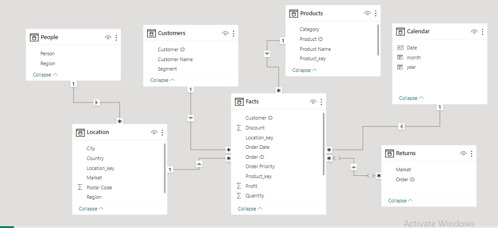
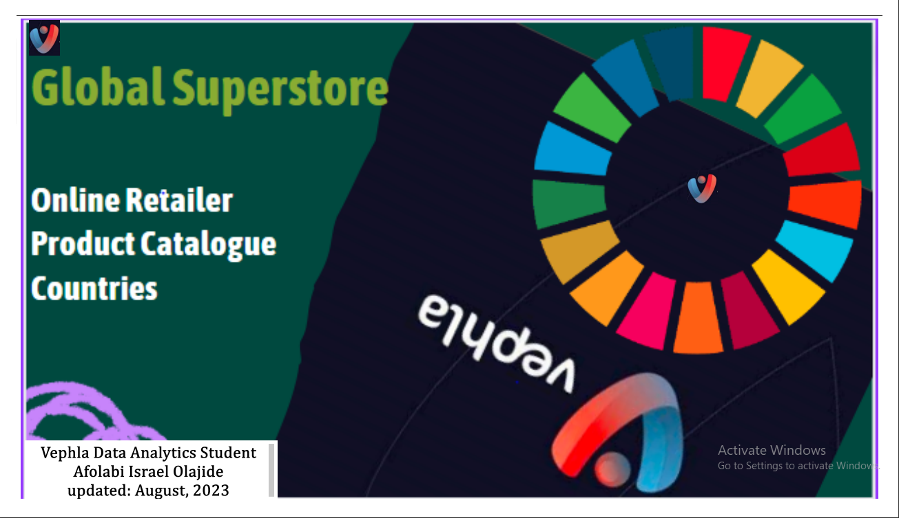
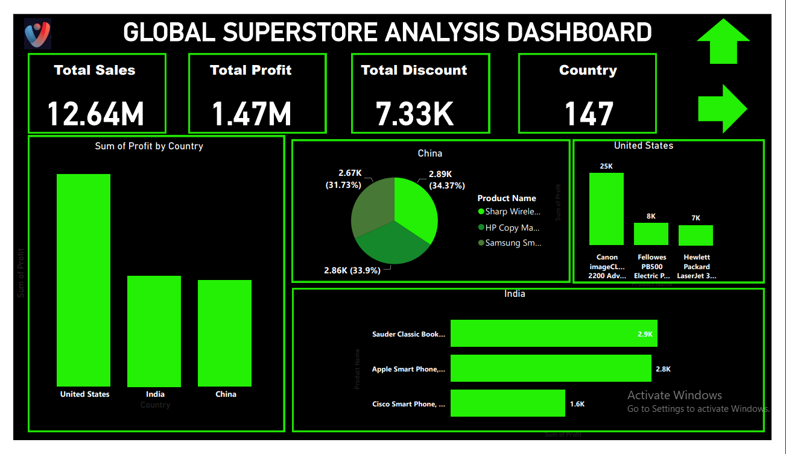
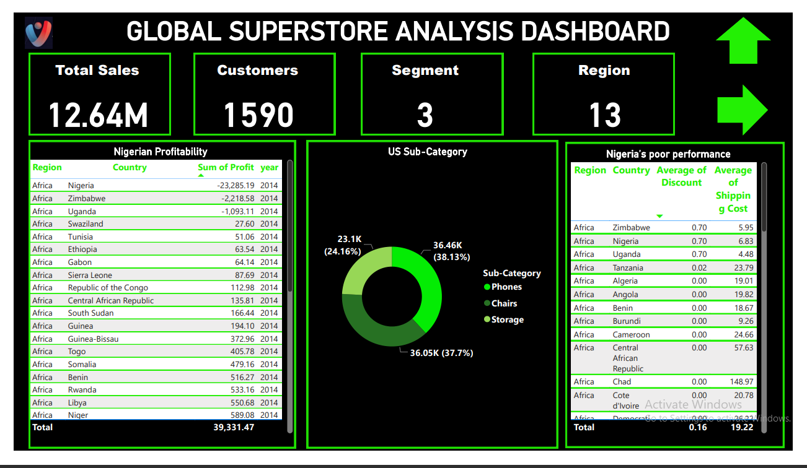
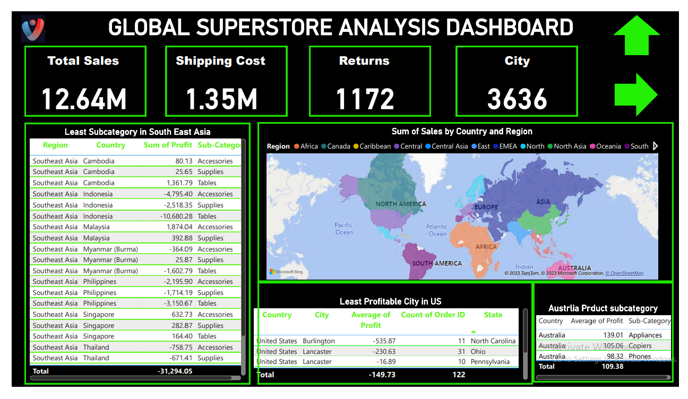
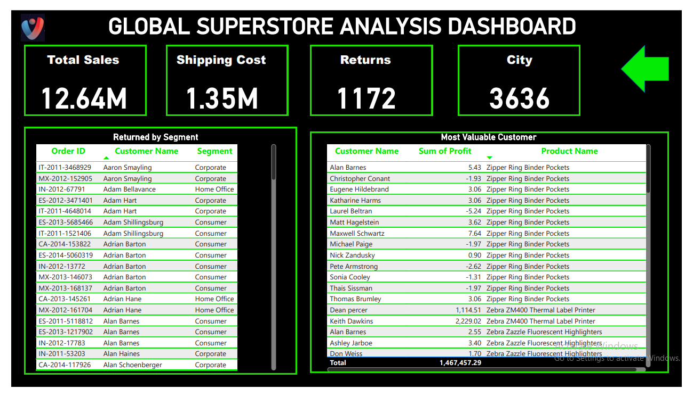

# Global_Superstore
As a Data Analyst willing to help Global Superstore analyze and draw out 
meaningful insight from the Superstore dataset which would aid management in making 
informed decisions to improve performance and profitability

# Introduction
As a data analyst, this task involves delving into Global Superstore's financial and operational data for the year 2014. By leveraging data exploration and analytical techniques, we aim to uncover meaningful insights and patterns within the dataset. The questions span various aspects, including profitability across countries, shipping costs, product subcategories, customer behaviors, and geographical trends. Our analysis will contribute to a deeper understanding of the company's performance and aid in making informed decisions to enhance its operations and profitability.

**_Disclaimer:_** All datasets and reports do not represent any institution or organization but just dummy datasets to demonstrate the capabilities of Microsoft Power BI

# Problem Statement

- Question 1.
What are the three countries that generated the highest total profit for Global
Superstore in 2014?

- Question 2.
Identify the 3 subcategories with the highest average shipping cost in the United States.

- Question 3.
Assess Nigeria’s profitability (i.e., total profit) for 2014. How does it compare to other
African countries?

- Question 4.
Identify the product subcategory that is the least profitable in Southeast Asia.

# Skills/Concepts Demonstrated

 

- Data Analysis and Exploration
- Data Visualization
- Statistical Analysis
- Critical Thinking
- DAX (Data Analysis Expression)

  # Modelling
  I employed a star schema for my data modeling approach.
 
  
 # Visualization
The Dashboard comprises of 

- Home Page

  

- Profitable Countries
  

- Highly Profitable Products

- Nigeria's Profitability and Comparison

- Least Profitable Subcategory in Southeast Asia
  

 # Recommendation
- Focus on Top-Performing Markets: Given that certain countries are generating the highest total profit, allocate more resources and marketing efforts to these countries.
- Nigeria Market Strategy: To address Nigeria's lower profitability compared to other African countries, delve into the factors impacting performance.
- Southeast Asia Product Strategy: Discontinue or reevaluate the least profitable product subcategory in Southeast Asia.

  # Conclusion
- **Global Superstore's profitability in 2014 was driven by select countries, emphasizing the importance of targeted marketing and strategic resource allocation.**

  Thank you
  

  You can connect with me on LinkedIn [Here](https://www.linkedin.com/in/israelafolabieasytech/)
